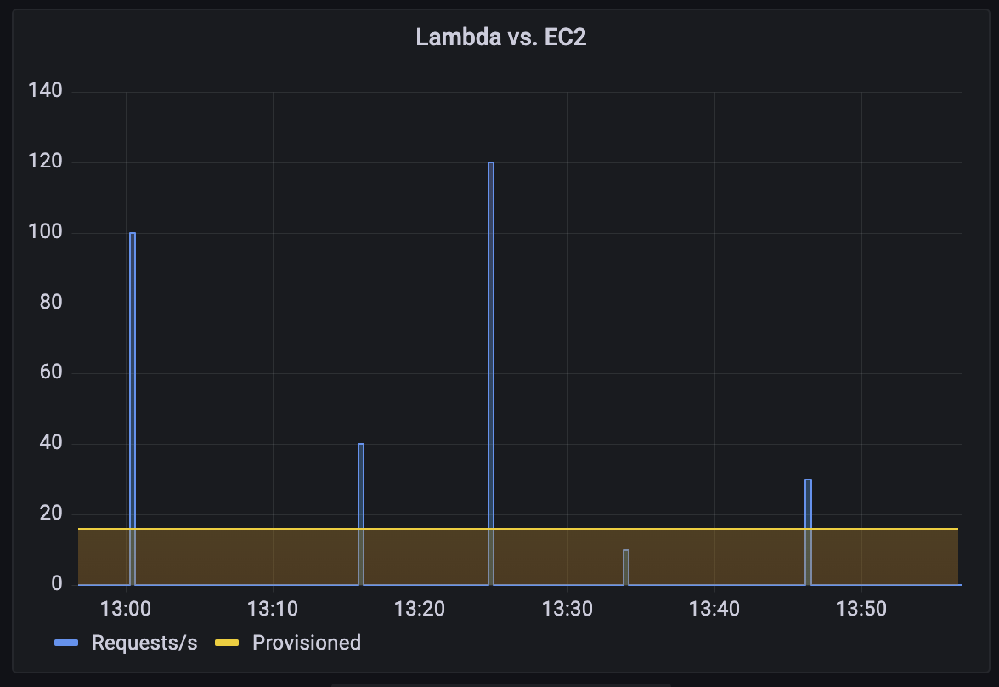

# timeless_containers

## Goal

Don't pay the cloud provider for "provisioned" containers, instead pay 0 when its idle

i.e. Pay for the blue area, don't pay for the yellow area.

What don't meet the requirements
- Any VM
- AWS ECS on Fargate (serverless is not timeless)

## Use cases
- CI/CD

## Existing solutions 

Read to use services
- Railway.app
- CircleCI
- Fly.io (microVM)
- Vercel
- Cloudflare Workers (Run in V8)

Proprietary building blocks
- GCP cloud run
- AWS App runner 
- AWS Lambda 

Open and free building blocks
- OpenFaaS
- Knative

## Requirements 

- Interface for traditonall apps/languages that are hard to add a HTTP request interface.
- Container based, accept Dockerfile for building images and deployment

## TODO:

- Convert any app that listens to `localhost:$PORT` to AWS Lambda and handle request by URL.

## References

- [GCP Cloud Run: HTTP -> Python -> any_binary](https://cloud.google.com/run/docs/tutorials/system-packages#run_system_package_handler-python)
- [re:Web: classic web run on AWS Lambda](https://github.com/apparentorder/reweb)

